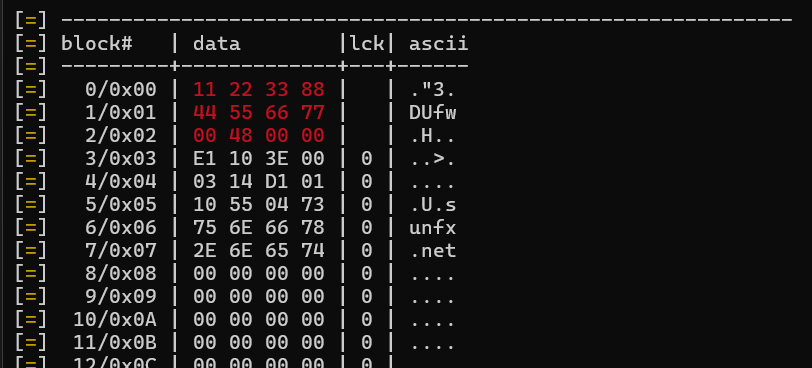

# NTAG215

## Writing content to the tag (URL/TEXT/WIFI/…)

1. Dump content to edit correct blocks via `hf mfu dump --ns` 
   We only wanna look at the topmost blocks

   

   **0x00/0x01 - UID** (Depending on if your tag is a magic card you could edit that but that is out of this scope)

   From the last byte of 0x05 onward you can save any data.

2. Now you can write content with `hf mfu wrbl -b <block> -d <encoded data>`
   FIrst convert your data into hex.
   sunfx -> 73756e66782e6e6574
   Now block that data into 4 bytes.
   `hf mfu wrbl -b 5 -d 10550473` -> s
   Data before the 73 seems to be some metadata so dont edit that, but with that command your first letter has now been written to the tag.
   `hf mfu wrbl -b 6 -d 756E6574` ->unfx

3. If theres somehow some data left or you need to delete something just wipe the block with `hf mfu wrbl -b <block> -d 00000000`

4. You can also verify what you did with  `hf mfu rdbl -b <block>`